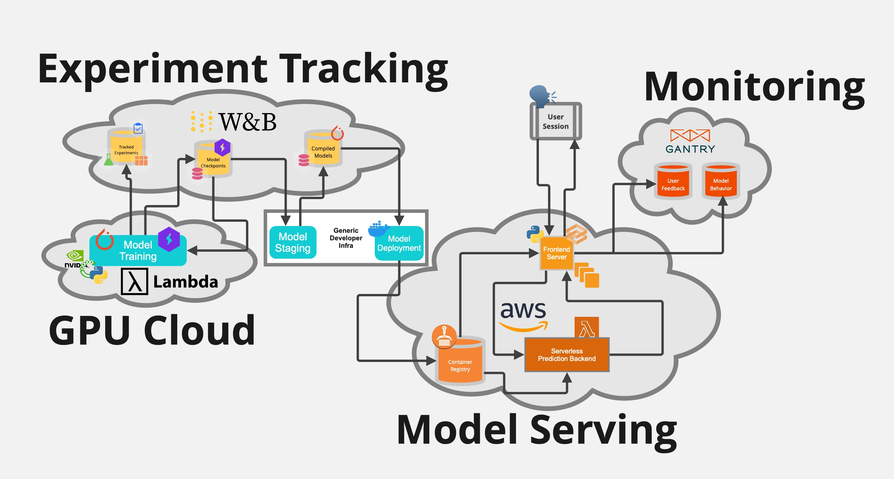

# FOG Computing Project

Welcome!

This repo was made as part of FOG Computing course lead by prof. dr. Vlado Stankovski.

## Architecture

Tracking/managment of our experiments was done using [Weights & Biases](https://docs.wandb.ai/).

We are packaging up the prediction system and deploying it as a [Docker](https://docs.docker.com/) container on [AWS Lambda](https://aws.amazon.com/lambda/).

Our prediction system is wrapped in a frontend written in Python using [Gradio](https://gradio.app/docs).
